# lab2web

## Nama     : Muhammad Romdhon
## NIM      : 312010434
## Kelas    : TI.20.A1
## Matkul   : Pemograman web

## Langkah-langkah praktikum
  Disini saya akan melakukan langkah-langkah praktikum *CSS* dasar HTML dengan menggunakan *Visual Studio Code.*
 Langkah pertama buka *Visual Studio Code.*
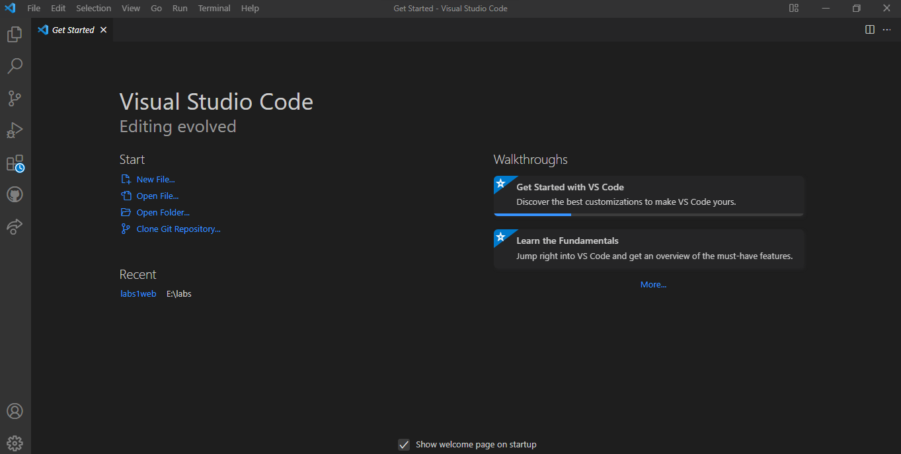

## 1. Membuat dokumen HTML
  Buatlah dokumen HTML seperti berikut:
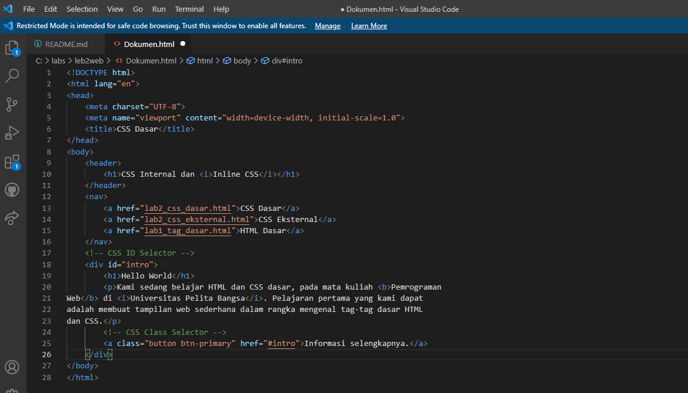
  Selanjutnya buka file tersebut menggunakan browser, untuk melihat hasilnya
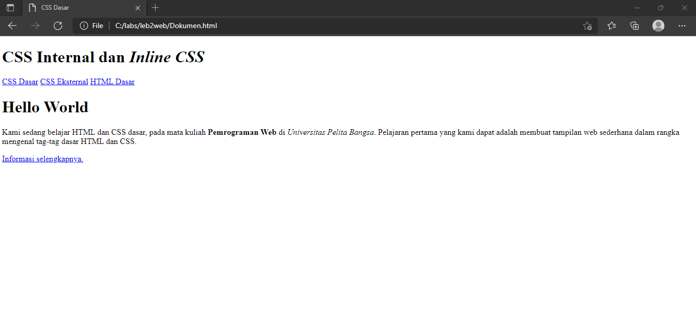

## 2. Mendeklarasikan CSS Internal
 Kemudian tambahkan deklarasi *CSS* internal seperti berikut pada bagian `head` dokumen.
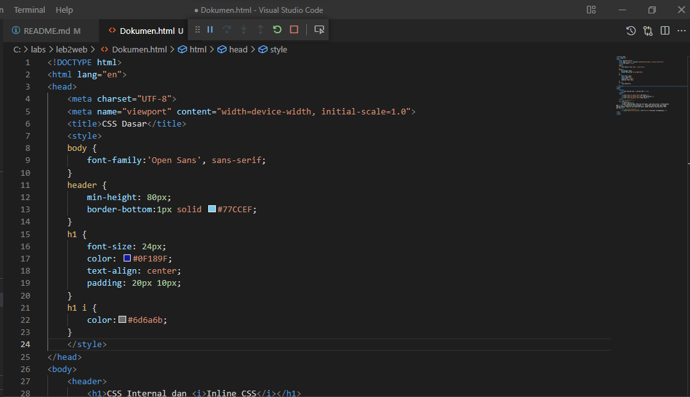
 Selanjutnya buka browser lalu refresh dan lihat hasilnya.
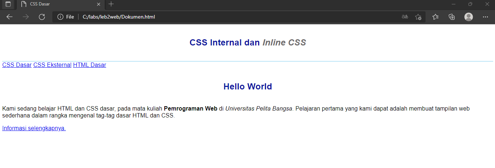

## 3. Menambahkan Inline CSS
  Kemudian tambahkan deklarasi inline CSS pada tag `
` seperti berikut.
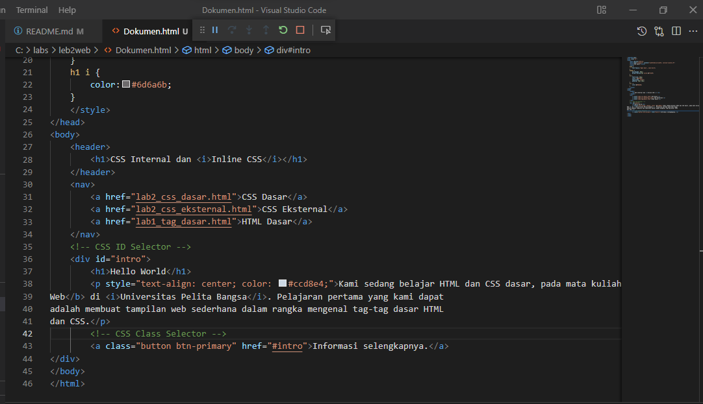
  Selanjutnya buka browser lalu refresh dan lihat hasilnya.
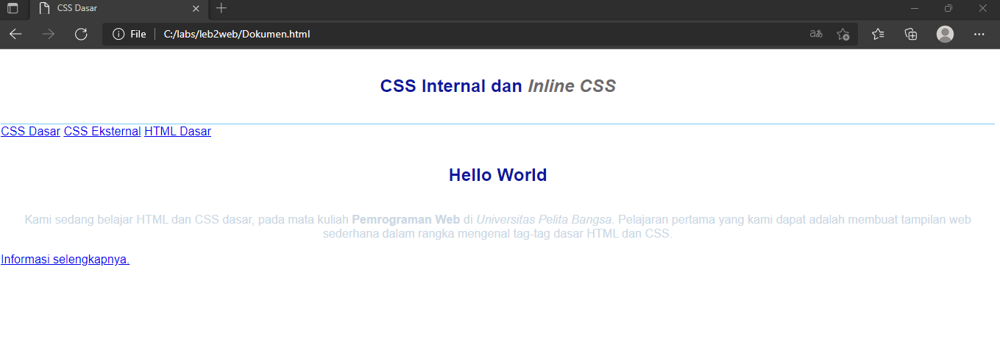

## 4. Membuat CSS Eksternal
  Buatlah file baru dengan nama `style_eksternal.css` kemudian buatlah deklarasi CSS seperti berikut.
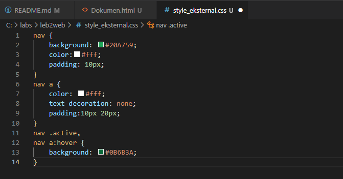
  Kemudiann tambahkan tag `<link>` untuk merujuk file css yang sudah dibuat pada bagian `<head>`
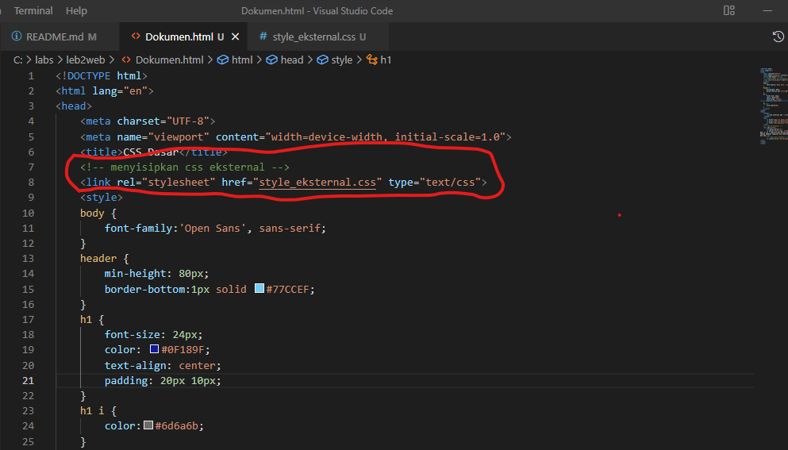
  Selanjutnya buka browser lalu refresh dan lihat kembali hasilnya.
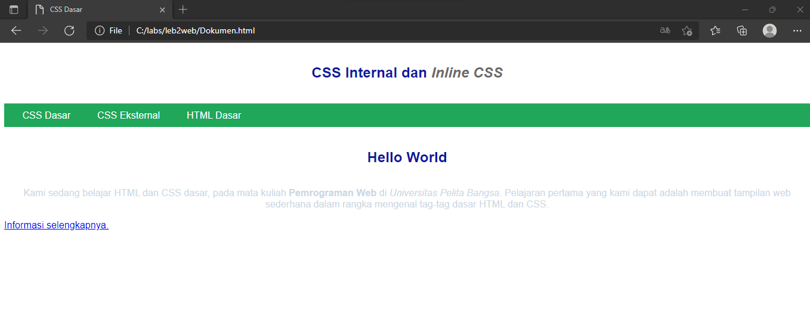

## 5. Menambahkan CSS Selector
 Selanjutnya menambahkan CSS selector menggunakan ID dan Class selector. Pada file `style_eksternal.css`, tambahkan kode berikut.
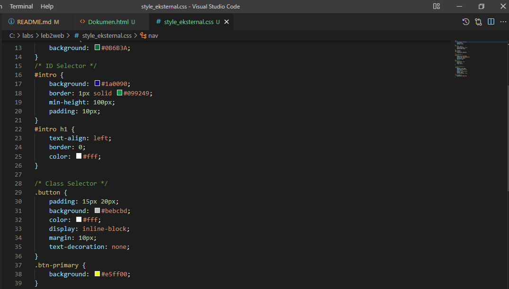
 Kemudian simpan kembali buka browser lalu refresh dan lihat hasilnya.
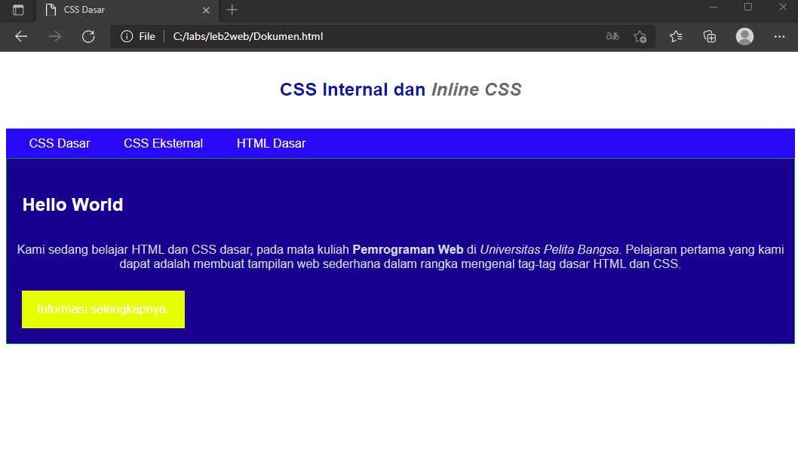
  sekian dari saya tentang penjelasan praktikum CSS dasar 
  
 **Terima Kasih**